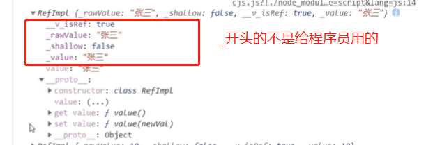
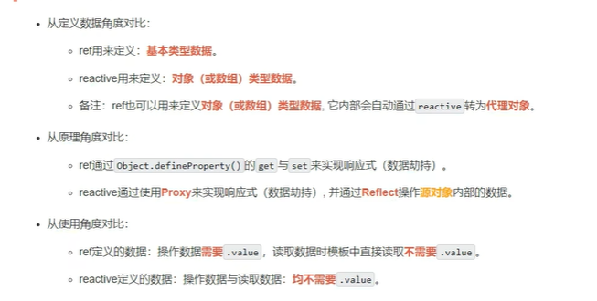

# 常用Composition API

`Composition API` 组合式API

## setup

- 理解：`vue3`中的一个新的配置项，**值是一个函数**。

- `setup`中可以写的内容：

  - 数据，如`vue2`中的`data`
  - 方法，如`vue2`中的`methods`、`computed`、`watch`等都在这里写
  - 生命周期函数

- `setup`函数返回值：

  - <font color=red>返回对象，则对象中的属性、方法，在**模板**中均可直接使用</font>。**重要**

    在`Vue2`中是`data`中的数据可以直接在模板中使用

  - 返回渲染函数：则可以自定义渲染内容。优先使用渲染函数的内容，直接覆盖了模板。了解

- 细节

  - `vue2`和`vue3`区别
    - `vue2`和`vue3`的配置可以同时出现，在模板中都可以使用二者**但是不建议这么做**
    - `vue2`可以访问`setup`中的属性和方法，但是`setup`访问不了`vue2`的（`data`、`methods`、`computed`）
    - `vue2`和`vue3`如果重名，在模板中优先使用`vue3`

  - <font color=red>`setup`不能使用`async`修饰</font>

    - 因为返回的不再是原始return的内容，而是`promise`，模板中看不到`return`的对象和属性

    - 获得`promise`中的`value`使用`.then`方法

    - 场景：在`setup`中发送了`axios`请求，使用`then`获得返回数据

      如果写`then`写烦躁了，可能就用`await`获取`promise`的值

      而`await`需要封装在`async`中，可能顺手就给`setup`前面写了`async`，导致错误的发生

## ref函数

### 基本介绍

- 区分：

  - `vue2`的`ref`属性，是给一个模板绑定一个唯一的标识，后续操作这个节点

  - `vue3`的`ref`是一个函数，ref函数包裹的内容会成为`RefImpl`**对象**

    - `ref`：`reference`引用

    - `impl`：`implement`实现

    - `RefImpl` 

      - 全称：**引用实现的实例对象**
      - 简称：**引用对象**
        - `RefImpl`中封装了`get`和`set`	

      

- 注意：
  - 在`JS`中使用响应式数据需要`.value`
  - 但是在模板中无需使用`.value`，会自动解析读取`.value`值

### ref处理数据

- **语法**：`const xxx = ref(initValue)`

  - 创建一个包含响应式数据的引用对象，简称`ref`对象
  - JS中操作数据:`xxx.value`
  - 模板中读取数据：不要`.value`，直接使用名字即可

- 备注

  - 接受的数据：基本数据类型、对象类型数据

    - **基本数据类型**：使用ref函数会被封装为`RefImpl` 通过`.value`获取数据;

      响应式依靠`Obejec.defineProperty()`的`get`与`set`完成

      ```vue
      <script>
        export default {
          setup(){        
            let name = ref('张三') 
            // 返回对象
            return {
                name          
            }    
          }    
        }
      </script>
      ```

    - **复杂数据类型**：使用ref函数会被封装为`RefImpl`,其中`.value`的内容会接着被封装为`Proxy`对象

      内部求助了`vue3`中的一个新函数，`reactive`

> 数据劫持才是响应式的根基

## reactive函数

- **作用**：定义一个**对象类型**的响应式数据

- 语法：`const xxx = reactive(源对象)`

  接受一个对象或数组，返回代理对象（`proxy`的实例对象，简称`proxy`对象）

- `reactive`定义的响应式数据是深层次的

  内部基于ES6的`Proxy`实例，通过代理对象操作源对象内部数据操作

## ref和reactive对比



- 定义数据角度
  - `ref`：
  - `reactive`:
- 原理角度
  - `ref`：
  - `reactive`:
- 使用角度
  - `ref`：
  - `reactive`: