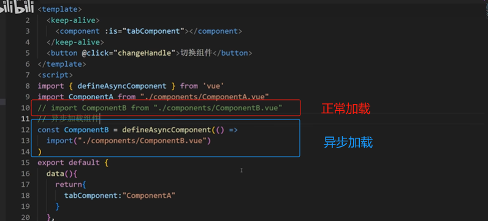

# vue3从入门到精通

## 前言

>笔记总结自bilibili视频
>
>[【2023最新版】Vue3从入门到精通，零基础小白也能听得懂，写得出，web前端快速教程](https://www.bilibili.com/video/BV1Rs4y127j8?p=3)

个人感觉，这个视频讲解的大部分都是`vue2`和`vue3`共有的，较小部分是`vue3`新特性。

由于笔者在学习`vue2`时，已经系统整理了学习笔记，因此该笔记仅总结了笔者认为值得重要的内容。

## vue API风格

vue组件可以按两种不同的风格书写，因为`vue`有两个大版本`vue2`和`vue3`：

- 选项式`API`(`Options API` )  `vue2`是选项式`API`
- 组合式`API `(`Composition API`) `vue3 setup`写法是支持组合式`API`

## vue开发前准备

- 熟悉命令行工具
  - 使用`windows+r`在弹出的窗口输入`cmd`，`cd`进入指定目录
  - 在文件管理器的路径中直接输入`cmd`进入指定目录的`cmd`，这样就不用`cd`
  - 或者直接在`vscode`提供的终端中

- `vue3`要求`nodejs`版本大于`15.0`

  建议使用`nvm`管理不同`nodejs`版本，使用哪个版本时随时切换

- 创建`vue3`项目(**重点**)

  - `vue-cli`
  - `vite` 
  - `create-vue`创建

  > 待补充！！！三个不同创建方式的区别

- 推荐开发环境`vscode`+`volar`

## vue项目目录结构

略

## 模板语法

- 模板语法有两类：分为插值语法`{{}}`和指令语法`v-xxx`

- **`vue`模板**：
- 写在`template`中的内容
  
- `vue`模板都是**语法层面**合法的`HTML`，可以被浏览器和`HTML`解析器解析。

### 插值语法{{}}

- 名称：插值语法、`mustache`语法、双大括号语法

- **插值语法作用**

  - 可以将组件实例`vc`中的数据绑定呈现在`DOM`上。

- **插值语法写在哪里？**

  - <font color=red>模板语法不能写在标签内的属性上，写在标签的属性上是不会被解析的</font>

- 花括号内支持的内容：

  - 文本插值

    - <font color=red>一个变量</font>，直接写

    - <font color=red>多个变量</font>，**使用模板字符串语法：反义字符串里面写${变量名}**。而不能使用逗号隔开，否则只读取最后一个逗号后的变量

      ```js
      // 正确写法
      {{`姓名: ${stu.name}, 年龄：${stu.age}`}} 
      // 错误写法 
      {{ stu.name, stu.age}} // 最终页面只显示stu.age
      ```

  - `js`表达式，每个花括号内仅支持**单一表达式**

    - 数学表达式、三目运算符 `? `、函数调用等等都可以，`if else`不行

    - **简单判断方法**：

      <font color=red>这段代码是否可以赋值给一个变量</font>、是否可以写在`return`后面

      注意区分表达式和语句，表达式的范围小于语句

### 原始HTML

- 问题：使用**双括号**会将里面的数据**所对应的内容转换成纯文本，不会解析`html`标签等特殊字符。**

- 解决方法：如果想要解析组件实例数据中的`html`标签等特殊字符，<font color=red>需要使用`v-html`指令</font>

  ```vue
  <!-- 1.xxx对应的数据会被渲染到p标签中,
       2.如果xxx中有html特殊标签,会被解析-->
  <p v-html='xxx'></p> 
  ```

## 属性绑定v-bind

- **属性**

  - `html`标签基本语法`<标签名 属性='属性值'>`，因此属性绑定是写在标签`<>`内

  - 可以是标签自带属性，也可以是自定义属性，都可以

- **作用**：

  - `v-bind`指令**将组件实例中的数据**传递给**模板中的属性值**，并保持一致，<font color=red>使得该属性的值为动态的。</font>

  - **如果绑定数据的值是`null`或者`undifined`，那么该属性将会从渲染的元素中移除**。

    即、打开浏览器开发者工具检查该元素是没有这个属性的。

- **语法**：

  - 动态绑定属性值 **常用**

  - <font color=red>动态绑定**属性名**和**属性值**，可同时绑定动态多个属性名和它对应的属性值</font>

    ```vue
    <template>
    	<div v-bind="objectAttrs">同时给div绑定多个属性和对应的值</div>
    </tempalte>
    <script>
        export default {
            data() {
                return {
                	objectAttrs:{
                        class:'myclass',
                        id:'myid'
                    }    
    			}
            }
        }
    </script>
    ```

    <font color=red>上述模板代码渲染后为</font>

    ```vue
    <div class='myclass' id='myid'>同时给div绑定多个属性和对应的值</div>

## 条件渲染

### v-if

- `v-if`
- `v-if`  `v-else`
- `v-if` `v-else-if` ...  `v-else`

### v-show

- 只能判定自己本身，不能和其他结合

### 对比

- `v-if`有较高的切换开销

- `v-show`有较高的渲染开销

## 列表渲染v-for

### v-for基本语法

- 语法：

  - 遍历数组

    - `item in items`/`(item, index) in items`

    - `item of items`/`(item, index) of items`

    看个人习惯：`item`名字可以更换，`in`或`of`都可以

  - 遍历对象

    - `item in items`，`item`是对象的`value`/ `(value, key, index) in items`
    - `item of items`

### key管理v-for状态

- 本节关注两点：
  - `key`的作用和简单虚拟算法
  - 不写`key`的`vue`如何操作 
  - 为什么不建议使用`index`作为`key`

#### 遍历列表时`key`的作用

- 首次渲染：

  - 初始数据→初始虚拟`DOM`（`Vnodes`）→将`Vnodes`转换成真实`DOM`

  - 如果有输出框，那么用户操作的是第三步的真实`DOM`

- 数据更新：

  - 新数据→新的虚拟`DOM`，`Vnodes`→虚拟`DOM`对比算法→根据对比结果复用或渲染新`DOM`

  - 数据更新时，虚拟`DOM`对比和更新方法

    - 对比一个`Vnodes`下的所有节点，里面哪个节点没变就可以复用，变化了的部分重新渲染。

      而不是以整个`Vnodes`为单位，要求其下面所有节点都一致才能复用。

    - `Vnodes`节点

      - 文本节点（纯文字内容）

      - 标签节点（对比标签名、标签所有属性）

    

    

    **注意**：`Vnodes`上有`key`属性，而真实`DOM`上没有

#### 写`key`和不写`key`

- 不写`key`会自动使用`index`作为`key`

- **作用**

  确保每一个渲染项都有唯一一个`index`，在`vue`中标识唯一虚拟节点

  (`key`相当于人类社会中的身份证号）

- **注意：**

  `key`属性是`vue`内部自己在用，**所以`key`属性并不会渲染在真实`dom`节点上，使用浏览器开发者工具检查dom是看不到key的**

#### 为什么不建议使用`index`作为`key`的值

- 如果对数据进行：逆序添加、逆序删除等**破坏数据**的操作

  会产生没必要的真实`DOM`更新，使得效率低。（但是对界面效果无影响）

- 如果虚拟节点下存在输入类`DOM`，如`input`

  会产生错误的`DOM`更新，使得界面展现有问题。

## 事件处理

- 分类

  - 内联事件处理器：直接把逻辑代码写在`@事件名='xxx'`

  - 方法事件处理器：`@事件名=事件回调函数`

    - 回调函数处**不写括号**

      无法传递其他参数

      在实例对象中，可以接受一个形参`e`作为，它是`	js`原生的`event`对象

    - 回调函数处**写括号**

      - 未手动写参数，组件实例可以接收实例对象

        此种写法等价于没写括号

      - 传递其他参数，没有写`$event`，在组件实例中没办法接受到事件对象

      - 传递其他参数，且手动写了`$event`（需要写在最后），在组件实例的函数中可以拿到对应顺序的事件对象

## 事件修饰符

- **作用**
  - 处理事件时可以在回调函数直接调用如`e.preventDefault()`或`e.stopPropagation()`等方法
  - **但是使用事件修饰符可以简化代码，还可以使回调函数专注于业务逻辑，而不用处理`DOM`细节。**
- 常见事件修饰符：
  - `.stop` 阻止冒泡
  - `.prevent` 阻止默认事件，比如`a`标签的自动跳转
  - `.once` 事件只会触发一次
  - `.enter` 按键触发

## 数组变化侦测

- 根据**改变一个数组时是否会引起`UI`的自动变化**将数组方法分为两类：
  1. 变更方法 
  2. 替换一个数组的方法

- 变更方法

  使用下列方法操作数组，`UI`会自动更新。

  - `push`、`pop`
  - `shift`、`unshift`
  - `splice`
  - `sort`
  - `reverse`

- 替换数组

  使用下列方法操作数组，`UI`不会自动更新。

  - `filter`
  - `concat`
  - `slice`

  > **问题：**如果使用了**替换数组**的方法，那该怎么让UI发生变化呢？
  >
  > 手动赋值做替换：`this.arrList = this.arrList.cancat([‘pp’])`   
  >
  >  // 通过`this`赋值替换操作让UI检测到

> **原因**：是否会导致UI主动变化的原因
>
> 变更方法会改变原数组，而替换数组方法不会改变原数组。

## 计算属性

模板表达式虽然方便，但是会让模板中写过多逻辑会让模板臃肿，因此将相关内容写在计算属性`computed`中。

> **问题**：模板中可以写函数调用或变量，那可不可以将`computed`的函数写在`methods`中，在模板中调用？
>
> - 计算属性：**计算属性值会基于其响应式依赖被缓存**，一个计算属性只有在其依赖的属性发生变化时才会重新计算
> - 方法：**方法调用总是会在**<font color=red>重新渲染发生时</font>**再次执行函数**
>
> 

## class绑定

### :class增强

- 在普通属性的`v-bind`中

  - `v-bind:xxx="xxx"`

    后面的`xxx`只能是一个值为字符串的变量，不能是数组、对象。

  - `v-bind="obj"`

    `v-bind`后未指定具体属性时，等号后可接一个值为对象变量；

    `vue`会将这个对象的`key`、`value`以`key="value"`的形式渲染到真实`dom`上。

- `vue`专门为`v-bind:class="xxx"`/`:class="xxx"`用法提供了特殊的功能增强

  **使得后面的`xxx`的值不再局限于<font color=red>字符串，而是可以写数组、对象</font>。**

### 语法

- 字符串：将字符串内容渲染为`dom`类名。
- 数组：会将数组值渲染作为`dom`类名。
- 对象：`vue`会将`value`为`ture`（或可隐式转换为`ture`）的`key`渲染作为`dom`的类名。

> **注意**
>
> 数组和对象嵌套过程中，只能是**数组嵌套对象**，即外层数组内层可写对象，反之则不行。

## style绑定

- `vue`也为`v-bind:style="xxx"`/`:style="xxx"`绑定提供**特殊的功能增强**

  使其绑定到的值`xxx`可以为<strong style="{ ‘color' : ‘red’}">字符串、数组、对象</strong>

- 语法

  - **字符串**

  - **数组**：不建议使用，因为`style`本身就是对象的形式

  - **对象**

    - `:style = "{ key1: 'value', key2: 'value2'}"` 

      - **值如果是死的字符串**，那么就需要添加单引号

      - 而key永远不用添加引号；

      - 多个属性之间用逗号分隔

    - `:style = "{ key: value} "` 

      - **值动态决定**，那么`value`就不能添加单引号，它对应于`data`中的变量

      - 注意点：

        动态绑定属性值时，可能需要在模板中拼串，比如 `+ px`等操作

## 侦听器

- 作用：可以监听到`data`中数据的变化

- 语法：

  ```js
  watch:{
      // 函数名必须和监听的数据名称保持一致
  	监听的属性名(newValue,oldValue){
  		// 业务逻辑
  	}
  }
  ```

##  表单输入绑定

- `v-model`修饰符

  - `.lazy`

    - 默认情况下，`v-model`会在每次`input`事件后更新数据

      `input`事件：输入内容改变就会触发

    - 添加`.lazy`修饰符来改为在每次`change`事件后更新数据。

      `change`事件：输入框失去焦点时会触发，如鼠标点击其他地方

  - `.number`，输入数据转换成`number`类型

  - `.trim`，输入删除空格

  ``` js
  <input type='text' v-model.number = 'xxx'/>  // 数据类型
  ```

## 模板引用

- 作用：使用`ref`相关内容，在`vue`中直接读取`dom`、操作`dom`

- 语法：

  - 模板中：给标签添加`ref='domname'`属性
  - `vue`中：
    - 获取`dom`元素：`this.$refs.domname`
    - 使用原生`js`的属性`xxx`进行操作：`this.$refs.domname.xxx`

- 总结，已有的对模板的操作

  - 修改内容：使用插值语法
  - 修改属性：使用`v-bind`/`:`
  - 事件：`v-on`/`@`

  - 操作`dom`：`ref`

## 组件组成

- 定义：将`vue`组件定义子定义在一个单独的`.vue`文件中，单文件组件称为`sfc`

- 优势：可复用性，提高开发效率和可维护性

- 在一个组件中使用其它组件使用步骤：

  1. 引入其它组件`import`

  2. 注册引入组件`compoents:{ }`

  3. 在标签中使用`< xxx />`

## 组件注册方式

- 前提：一个`vue`组件在使用前必须被注册，这样`vue`才能在渲染模板时找到其对应的时间。

- 组件的注册有两种方式：

  - 全局注册：在最外侧`main.js`中`import`和注册`app.component()`

    - 优点：方便，全局注册后，在任意组件的`template`中都可以使用该组件
    - 缺点：
      - 全局注册后，没有被使用的组件也会被打包，无法自动移除（`tree-shaking`）
      - 全局注册在大型项目中的依赖关系不那么明确。

    

  - 局部注册：在某一个组件`import`和写在`components`下，之后就可以在该组件的模板中使用该组件

## 组件传递数据

- 需求：组件和组件之间并不是完全独立的，有时候需要通信传递数据

- 语法：

  - 父组件的模板中：

    在子组件的标签上以`:key='xxx'`（活数据）/`key='xxx'`（死数据）的形式传递数据

  - 子组件的实例中：在`data`平级的`props`中写接受信息

> **注意**
>
> - `props`传递数据只能从父亲到子，不能从子到父。
>
> - **且子组件处不能直接修改数据,使用子组件的`methods`方法修改数据是不行的**！
>
>   如果需要修改数据，应该在子组件处使用触发父元素方法，让父元素修改数据。

- 可传递的数据类型：任何数据类型，下面是常见的三个类型
  - 基本数据类型，比较常见的字符串、数字
  - 数组
  - 对象

- `props`传递校验

  在子组件的`props`中更细致的声明对传入数据的要求，

  - 类型`type`，如果支持多种类型使用数组包含多个类型，如`[String,Number]`

  - 是否必须`require`

  - 默认值`default`

    - 基本数据类型：可以直接写`default:值`

    - 数组和对象：必须通过工厂函数返回默认值

      `default()=> ['']`、`default()=> ({})`

## 组件事件

- 作用：`$emit`触发自定义事件，实现子组件给父组件传递数据

- 操作：

  - 子组件：

    - 子组件触发事件执行回调函数
    - **在该回调函数中使用`this.$emit`方法触发父组件定义在子组件身上的自定义事件**

  - 父组件：

    - 在模板中使用子组件，在子组件上绑定自定义事件和回调函数，**此处回调函数不用写括号和参数**

    - 在实例中的`methods`下，写对应的回调函数，（**如果有接受数据，需要在此处写接受的参数**）

  - 完成流程
    1. 用户**点击、用户输入等操作**触发子组件上绑定的回调函数
    2. 子组件回调函数触发父组件的自定义事件，执行父组件自定义事件对应的回调函数

## 组件事件配合v-model使用

- 需求：

  - 用户在子组件使用`v-model`输入数据
  - 在父组件上实时接收、展示数据。

  **常见场景**，搜索子组件接受用户的输入，父组件展示数据。

- 解决方法：

  - **难点**：<font color=red>应该在哪里触发父组件的自定义事件，即在哪里写`this.$emit('事件名',数据)`？</font>

    之前学习的子组件给父组件通信，是由子组件的**点击事件（程序员编程显示指定的用户操作）**等事件触发，然后在点击事件的回调函数中使用`this.$emit`**触发父组件的自定义事件**。

  - **解决方法**：

    - **在`watch`中监听对应的属性**，
    - 当属性值发生改变时**自动执行**`this.$emit(‘自定义事件’，newValue)`，触发自定义事件将数据传递给父组件

> **拓展**
>
> 只要数据发生改变就进行一些操作，优先考虑`watch`，因为`watch`的作用就是检测数据的变化。

## 组件数据传递

- `props`可以通过特定操作，实现子传父

https://www.bilibili.com/video/BV1Rs4y127j8/?p=29&spm_id_from=pageDriver&vd_source=dde2f4dd432156027fedf9b1734ba705

## 透传Attributes

- 透传定义：传递数据给一个组件，却没有被该组件声明为`props`、`emits`的`attribute`、`v-on`事件监听器三者之一。

- 透传的`attribute`会自动被添加到根元素上。

  

## 插槽

- **需求**：

  - `props`

    之前学习了`props`，使得子组件可以接受父组件传递过来的任意`JavaScript`数据类型的数据。

  - `slot`
    - 那么子组件如何接受父组件传递过来的模板内容呢？
    - 在某些场合，可能想要**给子组件传递一些模板片段**，让子组件在自己的组件中渲染。

- **默认插槽**

  - 实现步骤：

    - 子组件：写`<slot></slot>`

      - 等父组件传递过来内容后，这里的东西将会被代替为父组件传递内容

      - 可以通过调整`slot`的位置来**调整模板片段的显示位置**

    - 父组件：在模板中使用子组件的**双标签形式，在双标签之间写要传入的模板内容**

  >`slot`是插槽出口，表示父元素**提供的**插槽内容将在哪里被渲染。
  >
  >

- **渲染作用域**

  - 原理

    **插槽内容可以访问到父组件的数据作用域**，因为插槽内容本身是在父组件的模板中的**定义的**。

  - **适用场景**

    插槽里面的内容用的了动态数据，那这个动态数据应该定义在父组件的`data`中还是子组件的`data`中？**写在父组件的`data`中**

- **插槽默认内容**

  - 作用：如果父组件没有传递模板片段给子组件，那么子组件可以显示一个默认值
  - 语法：在子组件的`slot`开始和结束标签之间写显示的默认内容，即`<slot>这里写默认内容<slot/>`

- **具名插槽**

  - 定义：有名字的插槽

    父组件可以传递多个插槽给子组件，此时父、子组件的插槽就需要给定名字。

  - 实现步骤：

    - 父组件：

      在子组件的**开始和结束**标签之间写：

      `<template #name1>这里写模板片段1</template>`

      `<template #name2>这里写模板片段2</template>`

    - 子组件：

      子组件中给`slot`标签添加`name=xxx`属性，即

      `<slot name="name1"><slot>`、`<slot name="name2"><slot>`

  > 具名插槽图片演示
  >
  > 

  > **同时使用匿名插槽和具名插槽传递数据给子组件**，父组件处写法：
  >
  > 

- **插槽中的数据传递（重要）**

  - 需求：在某些场景下插槽的内容可能想要<font color=red>同时使用父组件域和子组件域内的数据</font>，**要实现这个功能，需要让子组件在渲染时提供数据给插槽**

  - 实现方法：

    - 子组件

      - 在`slot`标签上使用`v-bind`绑定对应数据，即

        默认插槽`<slot :text='message'>`

        具名插槽`<slot name='title':text='message'>`

      - 注意：可传递多个数据，如果传递多个父组件会统一接受到一个对象中

    - 父组件

      - 对于匿名插槽

        在子组件的开始标签处使用`v-slot="slotProps"`接受子组件传递的数据，模板中使用`slotProps.xxx`使用数据

      - 对于具名插槽

        在对应的`template`开始标签处使用`#name="slotProps"`，接受子组件传递数据，模板中使用`slotPrors.xxx`使用数据

      > **注意**
      >
      > - `v-slot='slotProps'`等号后面的名字不是一定要是这个,这个是习惯
      > - 父组件会将子组件传递的数据统一`slotProps`对象中接收，所以使用时就以`slotProps.xxx`方法使用

## 组件生命周期

- 生命周期意义：在不同的重要节点可以做一些重要的事情。


## 动态组件

- **需求**：有些场景需要两个或多个组件之间来回切换，被切换掉的组件会被卸载。

  （不是通过`v-if`和`v-show`方法，但是确实也可以通过这个方法切换）

- **实现**：

  主要操作在父组件的模板中

  `<component :is='xxx'></comppnent>` `xxx`代表要渲染的组件的名字

  

## 组件保持存活

- 需求

  - 当使用`<component :is='xxx'>`在多个组件之间切换时，被切换掉的组件会被卸载

  - 频繁的加载和卸载会耗费资源。

- 解决方法

  - 通过`<keep-alive>`组件强制被切换掉的组件仍然保持存活状态。

## 异步组件

- 组件分类：

  - 同步组件：项目一旦运行，所以项目都会加载

  - 异步组件：**用到哪个组件加载哪个组件**，可以让第一次打开应用时更快

- 异步组件

  - 作用：优化大型项目的性能

  - 实现：

    修改的代码是组件中的导入代码`import`,使用`defineAsynComponent`方法

    

    

**参考文章**

[vue3入门08 - 使用脚手架创建vue3项目](https://juejin.cn/post/7106300598491807780)

[一篇文章说清 webpack、vite、vue-cli、create-vue 的区别](https://juejin.cn/post/7095603836072493086)

[浅谈Vite 原理与 Webpack比较](https://juejin.cn/post/6923417451333959694?from=search-suggest)

