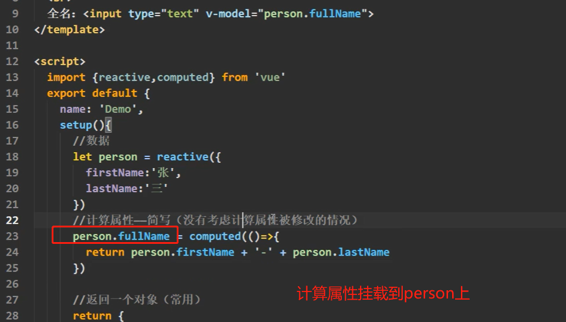

# vue3

## 常见Composition API

### ref函数

- 作用：实现数据类型的响应式

Vue3使用ref实现响应式（get setter数据劫持是响应式的根基）


ref对基本数据类型和对象属性类型是不同的处理方法

- 基本类型的数据：是get和set
- 对象类型的数据：vue的`reactive`函数

```js
     // 正确的更改方式(响应式更改)
      name.value = "李四";
      age.value = 39;
      job.value.type = "后端开发工程师";
      job.value.salary = "32k";
      
```

### reactive函数

- 作用：定义**对象类型**的响应式数据(基本类型请使用`ref`函数)

  proxy中的数据可以直接使用`.xxx`更改，就是响应式

  

  reative处理对象类型的时候是深层次的,可以一直`.`下去

### proxy

代理可以检查到增删改查


源数据: new Proxy传入的内容

代理数据: new Proxy赋值给谁

obj.propertyname 后面只能跟字符串，如果属性是对象形式必须使用obj[propertyname ]


`Reflect.方法`也可以增删改查对象，不只是用最原始的赋值符号和delete

Reflect.get()查找

Reflect.set()修改/新增属性

Reflect.deleteProperty()删除

Reflect上也有`defineProperty`的方法


`Object.defineProperty`数据代理 获得和更改数据


### ref和reactive对比

数据代理：

数据劫持（响应式）：当代理数据发生变化时页面发生响应的变化


reactive用的比较多，

提问：基本数据类型无法使用`reactive`

解决方法：用到基本数据类型一般都会封装成对象

提问：如果封装了人、还有其他信息的对象

解决方法：将reactive里面的内容再分类


### setup注意点

#### vue2内容

* prop和attrs

`$attrs`可以接受父组件传递给子组件的数据，但是这个不能限制类型，而且使用还需要添加`$attrs`前缀

props可以限制类型，而且在模板中使用直接写即可。

如果在声明了`props`，`$attrs`中就没有数据了；`$attrs`是在捡漏、兜底

- 插槽

  - 使用方式：

    子组件留一个坑位，让父组件填充；

    父组件将内填充内容写在子组件的开始标签和技术标签中

  - 子组件可以通过`$slot`属性获得父组件传递过来的插槽内容

#### vue3内容

- `setup`执行时机

- `setup`接受的参数

  

### 计算属性



### 监视属性


### 生命周期

如果生命周期函数想和setup一起写，实现组合式api，需要将API前面加个on（除了created和beforrCreate）

组合式API里面写的生命周期的执行时机要比配置写快一点，但是在实际开发中比较无聊。

要么都用组合式API要么都用配置项

### 自定义hook函数

hook本质是一个函数，把`setup`函数中的组合式API进行了封装。

（就是在hook中使用到了的组合）

Hooks文件夹下文件的名字一般都是用`usexxx.js`命名

类似于Vue2的mixin

### toref&&torefs

torefs只会暴露第一层对象属性，其他层次的在模板中要继续写`.`的形式


## 其他Conposition API

## Compostitin API的优势


## 新的组件

### Fragment

### Teleport


